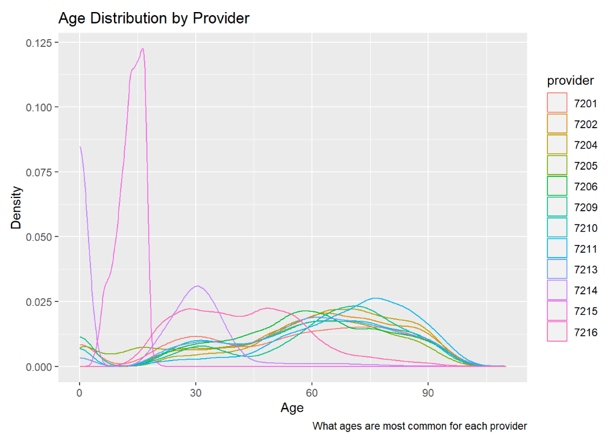
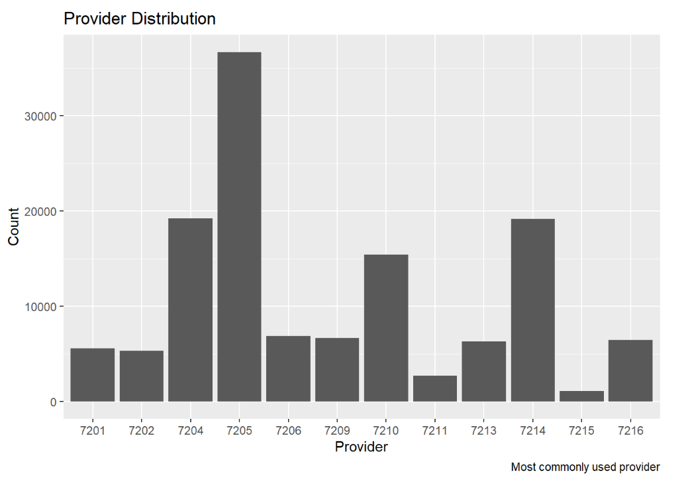
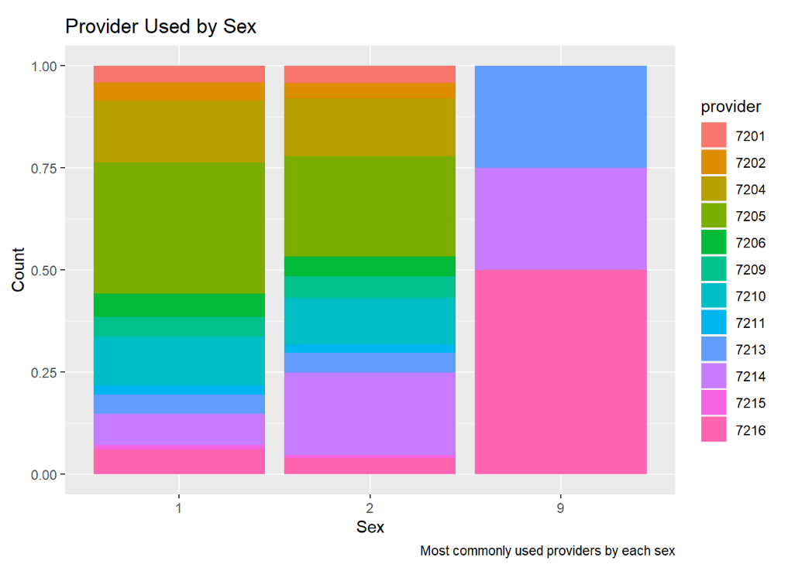
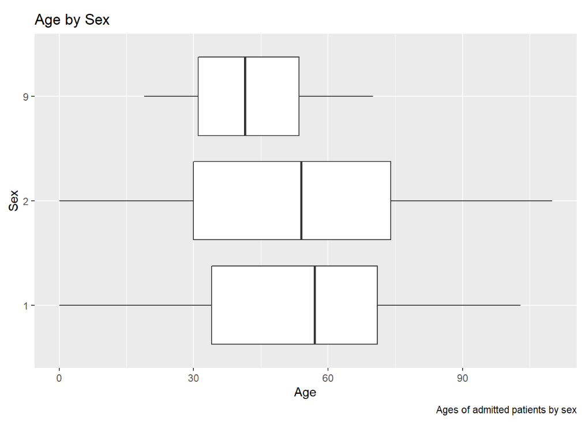

<style>

.remark-slide-content {
  background-color: #FFFFFF;
  border-top: 80px solid #F9C389;
  font-size: 17px;
  font-weight: 300;
  line-height: 1.5;
  padding: 1em 2em 1em 2em
}

.inverse {
  background-color: #696767;
  border-top: 80px solid #696767;
  text-shadow: none;
  background-image: url(https://github.com/goodekat/presentations/blob/master/2019-isugg-gganimate-spooky/figures/spider.png?raw=true);
	background-position: 50% 75%;
  background-size: 150px;
}

.your-turn{
  background-color: #8C7E95;
  border-top: 80px solid #F9C389;
  text-shadow: none;
  background-image: url(https://github.com/goodekat/presentations/blob/master/2019-isugg-gganimate-spooky/figures/spider.png?raw=true);
	background-position: 95% 90%;
  background-size: 75px;
}

.title-slide {
  background-color: #F9C389;
  border-top: 80px solid #F9C389;
  background-image: none;
}

.title-slide > h1  {
  color: #111111;
  font-size: 40px;
  text-shadow: none;
  font-weight: 400;
  text-align: left;
  margin-left: 15px;
  padding-top: 80px;
}
.title-slide > h2  {
  margin-top: -25px;
  padding-bottom: -20px;
  color: #111111;
  text-shadow: none;
  font-weight: 300;
  font-size: 35px;
  text-align: left;
  margin-left: 15px;
}
.title-slide > h3  {
  color: #111111;
  text-shadow: none;
  font-weight: 300;
  font-size: 25px;
  text-align: left;
  margin-left: 15px;
  margin-bottom: -30px;
}

</style>

```{r, include=FALSE}
library(haven)
library(tidyverse)
library(dplyr)
library(caret)
library(ggplot2)
library(rpart)
df <- read_csv('midterm_csv')
colSums(is.na(df))
df <- df %>% select(-payfix, -preopday, -obs_hour, -nicu_day)
```
#Most Common Ages Admitted!

.left-code[
```{r plot1, eval=FALSE}
df %>% ggplot()+
  geom_density(mapping = aes(x = age)) +
  labs(x="Age", y="Density", title = "Age Distribution", caption="Most common ages admitted")
```
]
.right-plot[
```{r, ref.label = "plot1", echo = FALSE, fig.height=6, fig.width=7}
```
]
---
#Most Common Ages Per Provider!

.left-code[
```{r plot2, eval=FALSE}
df %>% ggplot()+
  geom_density(mapping = aes(x = age, color=provider))+
  labs(x="Age", y="Density", title = "Age Distribution by Provider", caption="What ages are most common for each provider") 
```

]
---
#States with Most People Admitted!

.left-code[
```{r plot3, eval=FALSE}
df %>% ggplot()+
  geom_bar(mapping = aes(x = pt_state))+
  labs(x="State of Patient", y="Count", title = "State Location of Patients Distribution", caption="Which states have the most people admitted") 
```
]
.right-plot[
```{r, ref.label = "plot3", echo = FALSE, fig.height=6, fig.width=7}
```
]
---
#Most Common Gender Admitted!

.left-code[
```{r plot4, eval=FALSE}
df %>% ggplot()+
  geom_bar(mapping = aes(x = sex))+
  labs(x="Sex", y="Count", title = "Sex Distribution", caption="Gender most commonly admitted") 
```
]
.right-plot[
```{r, ref.label = "plot4", echo = FALSE, fig.height=6, fig.width=7}
```
]
---
#Most Commonly Used Provider!

.left-code[
```{r plot5, eval=FALSE}
df %>% ggplot()+
  geom_bar(mapping = aes(x = provider))+
  labs(x="Provider", y="Count", title = "Provider Distribution", caption="Most commonly used provider") 
```
]

---
#Ages with Highest Charges!

.left-code[
```{r plot6, eval=FALSE}
df %>% ggplot()+geom_point(aes(x=age, y=tot))+
  labs(x="Age", y="Total Chargers", title = "Chargers by Age", caption="Ages with the highest amount of charges")  
```
]
.right-plot[
```{r, ref.label = "plot6", echo = FALSE, fig.height=6, fig.width=7}
```
]
---
#Ages with Longest Stays!

.left-code[
```{r plot7, eval=FALSE}
df %>% ggplot()+geom_point(aes(x=age, y=los))+
  labs(x="Age", y="Length of Stay", title = "Length of Stay by Age", caption="Ages with the longest stays")  
```
]
.right-plot[
```{r, ref.label = "plot7", echo = FALSE, fig.height=6, fig.width=7}
```
]
---
#Most Commonly Used Providers by Sex!

.left-code[
```{r plot8, eval=FALSE}
df %>% ggplot()+
  geom_bar(mapping=aes(x=sex, fill=provider), position = 'fill')+
  labs(x="Sex", y="Count", title = "Provider Used by Sex", caption="Most commonly used providers by each sex")  
```
]

---
#Ages of Admiited Patients by Sex!

.left-code[
```{r plot9, eval=FALSE}
df %>% ggplot()+
  geom_boxplot(mapping = aes(x = age, y = sex))+
  labs(x="Age", y="Sex", title = "Age by Sex", caption="Ages of admitted patients by sex")
```
]

---
#Ages with Highest Amount of Charges!

.left-code[
```{r plot10, eval=FALSE}
df %>% ggplot()+geom_smooth(aes(x=age, y=tot))+
  labs(x="Age", y="Total Chargers", title = "Chargers by Age", caption="Ages with the highest amount of charges")   
```
]
.right-plot[
```{r, ref.label = "plot10", echo = FALSE, fig.height=6, fig.width=7}
```
]
---
#Gender Most Often Admitted by Age!

.left-code[
```{r plot11, eval=FALSE}
library(gganimate)
df %>% ggplot()+
  geom_bar(mapping = aes(x = sex)) + transition_states(age) +
  labs(x="Sex", y="Count", title = "Sex Distribution by Age", caption="Gender most commonly admitted for each age")   
```
]
.right-plot[
```{r, ref.label = "plot11", echo = FALSE, fig.height=6, fig.width=7}
```
]

```{r, include=FALSE}
df <- read_csv('midterm_csv')
df <- df %>% filter(raceethn!='', admtype!='')
df$tot2 <- ifelse(df$tot<median(df$tot),'low', 'high')
df <- df %>% 
  mutate(target = as.factor(tot2),
         sex = as.factor(sex),
         raceehtn = as.factor(raceethn),
         campus = as.factor(campus),
         moa = as.factor(moa),
         mod = as.factor(mod),
         admtype=as.factor(admtype))
df <- df %>% 
  mutate(age = as.numeric(age),
         los = as.numeric(los))
df <- df %>% select(target,age,sex,raceethn,provider,moa,mod,admtype,campus,los)
set.seed(2020)
splitIndex <- createDataPartition(df$target, p = .10, list=FALSE)
df_train <- df[ splitIndex,]
df_test <- df[-splitIndex,]
tree_model <- rpart(target ~ ., data = df_train,
                 control = rpart.control(maxdepth = 3))
library(rattle)
fancyRpartPlot(tree_model)
tree_model$variable.importance
barplot(tree_model$variable.importance)
tuneGrid = expand.grid(maxdepth = 2:10)
trControl = trainControl(method = "cv",
                         number = 5)
tree_approach2 <- train(target~., data=df_train, 
                  method = "rpart2", trControl                        =trControl, tuneGrid = tuneGrid)
plot(tree_approach2)
trControl1 = trainControl(method = "cv",
                         number = 5)
tuneGrid1 = expand.grid(mtry = 2:4,
          splitrule = c('gini', 'extratrees'),
           min.node.size = c(2:5))
forest_ranger <- train(target~., data=df_train, 
                    method = "ranger", 
                    trControl = trControl1,
                    tuneGrid = tuneGrid1)
plot(forest_ranger)
```
---

#Result Comparison!

.left-code[
```{r plot12}
results <- resamples(list('Decision Tree' = tree_approach2,'Random Forest' = forest_ranger))

bwplot(results)
```
]
.right-plot[
```{r, ref.label = "plot12", echo = FALSE, fig.height=6, fig.width=7}
```
]
---
#Confusion Matrix Comparison!

.left-code[
```{r plot13}
pred1 <- predict(tree_approach2, df_test)
cm1 <- confusionMatrix(data = pred1, reference = df_test$target)
cm1$overall[1]
```
]

```{r, include = FALSE}
df <- read_csv('midterm_csv')
df <- df %>% filter(raceethn!='', admtype!='')
df$los2 <- ifelse(df$los<mean(df$los),'low', 'high')
df <- df %>% 
  mutate(target = as.factor(los2),
         sex = as.factor(sex),
         raceehtn = as.factor(raceethn),
         campus = as.factor(campus),
         moa = as.factor(moa),
         mod = as.factor(mod),
         admtype=as.factor(admtype))
df <- df %>% 
  mutate(age = as.numeric(age),
         los = as.numeric(tot))
df <- df %>% select(target,age,sex,raceethn,provider,moa,mod,admtype,campus,los)
set.seed(2020)
splitIndex <- createDataPartition(df$target, p = .10, list=FALSE)
df_train <- df[ splitIndex,]
df_test <- df[-splitIndex,]

tree_model1 <- rpart(target ~ ., data = df_train,
                 control = rpart.control(maxdepth = 3))
fancyRpartPlot(tree_model1)
tree_model1$variable.importance
barplot(tree_model$variable.importance)

tuneGrid = expand.grid(maxdepth = 2:10)
trControl = trainControl(method = "cv",
                         number = 5)
tree_approach3 <- train(target~., data=df_train, 
                  method = "rpart2", trControl                        =trControl, tuneGrid = tuneGrid)
plot(tree_approach3)
trControl1 = trainControl(method = "cv",
                         number = 5)
tuneGrid1 = expand.grid(mtry = 2:4,
          splitrule = c('gini', 'extratrees'),
           min.node.size = c(2:5))
forest_ranger1 <- train(target~., data=df_train, 
                    method = "ranger", 
                    trControl = trControl1,
                    tuneGrid = tuneGrid1)
plot(forest_ranger1)

results <- resamples(list('Decision Tree' = tree_approach3,'Random Forest' = forest_ranger1))

bwplot(results)
```
---
#New Model Comparison!
.left-code[
```{r plotend}
results <- resamples(list('Decision Tree' = tree_approach3,'Random Forest' = forest_ranger1))

bwplot(results)
```
]
.right-plot[
```{r, ref.label = "plotend", echo = FALSE, fig.height=6, fig.width=7}
```
]
---
#New Model Cofusion Matirx!

.left-code[
```{r plot14}
pred2 <- predict(tree_approach2, df_test)
cm2 <- confusionMatrix(data = pred2, reference = df_test$target)
cm2$overall[1]
```
]
.right-plot[
```{r, ref.label = "plot14", echo = FALSE, fig.height=6, fig.width=7}
```
]
---
#Fun Issues!

- KNITTING!!!
- Plots not doing what the code says!